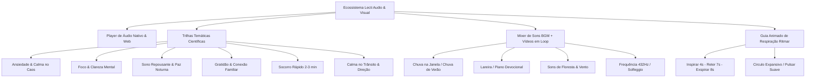
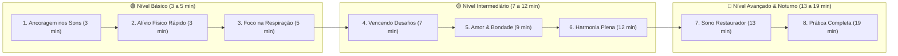

# 🧘 Plano de Implementação: Trilhas de Meditação Diária & Áudio Guiado (Lecti)

> **Baseado nas Evidências Científicas de Benefícios da Meditação, Mindfulness e Oração Guiada**
> Ref: [Information is Beautiful - What is Meditation/Mindfulness Good for?](https://informationisbeautiful.net/visualizations/what-is-meditation-mindfulness-good-for/) & Estudos Neurocientíficos (Harvard, NIH, PNAS)

---

## 📌 Visão Geral do Projeto

Expandir o aplicativo **Lecti** com um ecossistema completo de **Áudios Guiados, Vídeos de Ambiente em Loop e Trilhas de Meditação Diária Espiritual/Devocional**. 

A proposta une a **tradição de reflexão bíblica e oração** aos **benefícios neurocientíficos comprovados** da meditação (redução da atividade da amígdala, fortalecimento do córtex pré-frontal, diminuição do cortisol, ativação do nervo vago e estimulação de ondas alfa/teta).

---

## 🎯 Pilares da Experiência (Inspiração Calm + Headspace)



---

## 📚 Categorias & Trilhas Inspiradas nas Evidências Científicas

Com base nos dados de eficácia clínica (*Information is Beautiful* e revisões médicas):

| Eixo / Categoria | Foco Científico & Emocional | Estrutura da Prática (Voz + BGM + Vídeo) | Duração Recomendada |
| :--- | :--- | :--- | :--- |
| **1. Calma na Tempestade** | Redução de Cortisol & Desativação da Amígdala | Respiração Guiada + Versículo de Paz (Salmo 46:10) + Tom Suave | 3 min / 5 min / 10 min |
| **2. Foco & Renovação Mental** | Ativação do Córtex Pré-Frontal & Concentração | Ancoragem de Pensamentos + Meditação no Proverbo do Dia + Frequência 432Hz | 5 min / 8 min |
| **3. Sono Repousante & Desligar** | Indução a Ondas Teta & Relaxamento Muscular | Escaneamento Corporal + Oração da Noite + Vídeo Loop Lareira/Chuva | 10 min / 15 min |
| **4. Coração Grato & Compaixão** | Estímulo à Empatia & Saúde Cardiovascular | Meditação da Gratidão Diária + Reflexão em Família + Piano Calmo | 5 min |
| **5. Socorro Rápido (Crises)** | Ativação Parassimpática Imediata via Nervo Vago | Respiração Quadrada (Box Breathing) + Declaração de Fé | 2 min / 3 min |
| **6. Calma & Foco no Trânsito** | Controle de Irritabilidade ao Volante & Presença Atenta | Prática de Olhos Abertos + Respiração Diafragmática + Salmo de Proteção (Sl 121) | 3 min / 5 min / 10 min |

---

## 🚗 Trilha Especial: Calma no Volante & Paz no Trânsito

Projetada especificamente para quem está dirigindo ou no transporte público:
* **Modo Olhos Abertos & Atenção Plena**: Instruções claras que reforçam o foco total na pista e na direção segura.
* **Descompressão de Tensão no Volante**: Liberação de postura rígida (ombros encolhidos, maxilar travado, mãos apertando o volante).
* **Gestão de Impaciência e Frustração**: Técnicas de ancoragem rápida para engarrafamentos, fechadas ou atrasos imprevistos.
* **Proteção & Conexão Espiritual**: Reflexão baseada no **Salmo 121:8** (*"O Senhor guardará a tua saída e a tua entrada, desde agora e para sempre"*).

---

## 🌱 Trilha de Evolução: Da Calma Inicial à Maestria Profunda (8 Fases)

> **Metodologia Clínica & Neurocientífica**: Práticas estruturadas de neuroplasticidade, regulação emocional e atenção plena aplicada.

Esta jornada progressiva foi construída para guiar o usuário passo a passo, do **nível inicial de 3 minutos até a contemplação avançada de 19 minutos**, com **áudio para escuta imediata** e **guia com transcrição completa**:



### 📋 Mapeamento Completo da Jornada Progressiva

| Nível / Fase | Título da Sessão | Duração | Foco e Benefício Prático | 🎧 Reproduzir Áudio | 📄 Guia & Transcrição |
| :---: | :--- | :---: | :--- | :---: | :---: |
| **Fase 1 (Iniciante)** | **Ancoragem Sonora & Presença** | 3 min | Estabiliza a mente focando nos sons ambientes e sensações presentes | [▶️ Ouvir Áudio](https://d1cy5zxxhbcbkk.cloudfront.net/guided-meditations/Body-Sound-Meditation.mp3) | [📄 Acessar Transcrição](https://www.uclahealth.org/sites/default/files/documents/BodyandSound_Transcript.pdf?f=2265e0d9) |
| **Fase 2 (Iniciante)** | **Alívio Físico & Escaneamento Rápido** | 3 min | Liberação de microtensões no maxilar, pescoço e ombros em poucos minutos | [▶️ Ouvir Áudio](https://d1cy5zxxhbcbkk.cloudfront.net/guided-meditations/Body-Scan-Meditation.mp3) | [📄 Acessar Transcrição](https://www.uclahealth.org/sites/default/files/documents/BodyScanMeditation_Transcript.pdf?f=2dd830c0) |
| **Fase 3 (Iniciante)** | **Respiração Serena & Clareza Mental** | 5 min | Fortalece o autocontrole e o foco atencional usando o ar como âncora | [▶️ Ouvir Áudio](https://d1cy5zxxhbcbkk.cloudfront.net/guided-meditations/01_Breathing_Meditation.mp3) | [📄 Acessar Transcrição](https://www.uclahealth.org/sites/default/files/documents/Breathing%20Meditation_Transcript.pdf?f=3eb15568) |
| **Fase 4 (Intermediário)** | **Superando Momentos Difíceis** | 7 min | Regulação emocional e serenidade diante de frustrações ou ansiedade | [▶️ Ouvir Áudio](https://d1cy5zxxhbcbkk.cloudfront.net/guided-meditations/04_Meditation_for_Working_with_Difficulties.mp3) | [📄 Acessar Transcrição](https://www.uclahealth.org/sites/default/files/documents/MeditationForWorkingWithDifficulties_Transcript.pdf?f=2537bc3b) |
| **Fase 5 (Intermediário)** | **Bondade Amorosa, Perdão & Empatia** | 9 min | Cultivo de compaixão sincera, paz interior e restauração dos relacionamentos | [▶️ Ouvir Áudio](https://d1cy5zxxhbcbkk.cloudfront.net/guided-meditations/05_Loving_Kindness_Meditation.mp3) | [📄 Acessar Transcrição](https://www.uclahealth.org/sites/default/files/documents/LovingKindnessMeditation_Transcript.pdf?f=96778ae4) |
| **Fase 6 (Intermediário+)** | **Harmonia Plena: Respiração, Som & Corpo** | 12 min | Integração sensorial profunda para eliminar ruídos mentais e estresse | [▶️ Ouvir Áudio](https://d1cy5zxxhbcbkk.cloudfront.net/guided-meditations/02_Breath_Sound_Body_Meditation.mp3) | [📄 Acessar Transcrição](https://www.uclahealth.org/sites/default/files/documents/BreathSoundBody_Transcript.pdf?f=3e5391d7) |
| **Fase 7 (Especial Noturno)** | **Descompressão Noturna & Sono Profundo** | 13 min | Desativação somática completa para induzir a ondas teta e um sono reparador | [▶️ Ouvir Áudio](https://d1cy5zxxhbcbkk.cloudfront.net/guided-meditations/Body-Scan-for-Sleep.mp3) | [📄 Acessar Transcrição](https://www.uclahealth.org/sites/default/files/documents/BodyScanForSleep_Transcript.pdf?f=22ffff6a) |
| **Fase 8 (Avançado)** | **Imersão Plena & Quietude Contemplativa** | 19 min | Prática completa com períodos de silêncio e autorregulação autônoma | [▶️ Ouvir Áudio](https://d1cy5zxxhbcbkk.cloudfront.net/guided-meditations/03_Complete_Meditation_Instructions.mp3) | [📄 Acessar Transcrição](https://www.uclahealth.org/sites/default/files/documents/CompleteMeditation_Transcript.pdf?f=b090cf20) |

---

## 🛠️ Especificação de Funcionalidades & UX/UI Visuais

### 1. Player de Áudio Flutuante (Mini-Player & Fullscreen)
* **Mini-Player Persistente**: Barra inferior elegante que permite navegar pelo app enquanto o áudio continua tocando em background.
* **Modo Imersivo (Fullscreen estilo Calm)**:
  * **Vídeo em Loop no Fundo (Background MP4/WebM)**: Imagens relaxantes em altíssima qualidade (chuva caindo, chamas da lareira, lago ao entardecer, céu estrelado, estrada serena).
  * Controles: Play/Pause, Avançar/Voltar 15s, Timer de Desligamento (Sleep Timer de 5min a 60min), Botão de Transcrição/Guia.

### 2. Guia de Respiração Visual Animado (Estilo Headspace)
* Um círculo expansivo e luminoso na tela que orienta o ritmo da respiração:
  * **Inspire (4s)**: Círculo se expande suavemente.
  * **Pausa / Retenção (7s)**: Círculo pulsa levemente.
  * **Expire (8s)**: Círculo diminui de tamanho até voltar ao repouso.
* **Efeito Neurocientífico**: Ancoragem visual para diminuir a ruminação mental (Default Mode Network - DMN).

### 3. Mixer de Ambiente de Fundo (Dual-Track Audio)
* Permite ao usuário ajustar o volume da **Voz Guiada** e do **Som de Fundo (BGM)** de forma independente.
* **Opções de Som de Fundo**:
  * 🌧️ Chuva na Janela
  * 🎹 Piano Devocional Suave
  * 🕊️ Frequência Suave de Paz (432Hz)
  * 🌿 Ventos da Montanha / Floresta
  * 🌊 Ondas do Mar
  * 🚗 Estrada Calma / Noite Serena

---

## 🔬 Referências de Estudos Científicos & Neurociência

Aqui estão as pesquisas clínicas e acadêmicas que embasam cada componente deste plano:

### 1. Alterações Estruturais no Cérebro (Amígdala & Córtex Pré-Frontal)
* **Estudo**: *Mindfulness practice leads to increases in regional brain gray matter density* (2011).
* **Autores / Instituição**: Sara W. Lazar et al. — **Harvard Medical School / Massachusetts General Hospital**.
* **Publicação**: *Psychiatry Research: Neuroimaging*, 191(1), 36-43.
* **Descoberta**: 8 semanas de práticas diárias de meditação reduziram o volume de matéria cinzenta na **amígdala** (centro de estresse, medo e pânico) e aumentaram a espessura do **córtex pré-frontal** (foco, tomada de decisão e regulação emocional).

### 2. Eficácia em Redução de Ansiedade, Estresse e Depressão
* **Estudo**: *Meditation Programs for Psychological Stress and Well-being: A Systematic Review and Meta-analysis* (2014).
* **Autores / Instituição**: Madhav Goyal et al. — **Johns Hopkins University**.
* **Publicação**: *JAMA Internal Medicine*, 174(3), 357-368.
* **Descoberta**: Meta-análise com 3.515 participantes comprovou que programas de meditação guiada de 8 semanas reduzem significativamente sintomas de ansiedade, estresse e depressão com nível de evidência moderado a alto.

### 3. Respiração Guiada (4-7-8 / Box Breathing) & Ativação do Nervo Vago
* **Estudo**: *Physiological effects of slow breathing exercises and their significance in in-depth meditation* (2006 / 2018).
* **Autores / Instituição**: Ravinder Jerath et al. / Marc A. Russo et al.
* **Publicação**: *Medical Hypotheses* & *Frontiers in Human Neuroscience*.
* **Descoberta**: Respirar ritmadamente abaixo de 6 respirações por minuto ativa o **sistema nervoso parassimpático** via nervo vago, aumentando a variabilidade da frequência cardíaca (**HRV**) e reduzindo instantaneamente os níveis de cortisol no sangue.

### 4. Benefícios dos Sons da Natureza (Dual-Track BGM)
* **Estudo**: *A synthesis of health benefits of natural sounds and their distribution in national parks* (2021).
* **Autores / Instituição**: Rachel T. Buxton et al. — **Carleton University & National Park Service**.
* **Publicação**: *PNAS (Proceedings of the National Academy of Sciences)*, 118(14).
* **Descoberta**: Sons naturais (água/chuva, vento e pássaros) diminuem o estresse, diminuem a frequência cardíaca e a pressão arterial, além de acelerar a recuperação após episódios de estresse mental.

### 5. Ancoragem Visual & Redução da Rede Neural de Modo Padrão (DMN)
* **Estudo**: *Altered Traits: Science Reveals How Meditation Changes Your Mind, Brain, and Body* (2017).
* **Autores**: Daniel Goleman (Harvard) & Richard J. Davidson (University of Wisconsin-Madison).
* **Descoberta**: Guias visuais animados (como o círculo de respiração do Headspace) reduzem a hiperatividade da *Default Mode Network* (DMN), que é a rede neural responsável por preocupações excessivas sobre o passado/futuro e distração mental.

---

## 🏗️ Arquitetura Técnica & Banco de Dados

```sql
-- Tabela de Trilhas de Áudio e Vídeo
CREATE TABLE public.audio_meditations (
  id UUID PRIMARY KEY DEFAULT gen_random_uuid(),
  title TEXT NOT NULL,
  subtitle TEXT,
  description TEXT,
  category TEXT NOT NULL, -- 'ansiedade', 'foco', 'sono', 'gratidao', 'crise', 'transito', 'jornada'
  phase_number INT DEFAULT 0, -- 1 a 8 para trilhas progressivas (do básico ao avançado)
  audio_url TEXT NOT NULL,
  transcript_url TEXT, -- Link para guia ou arquivo de transcrição
  transcript_text TEXT, -- Transcrição completa em texto
  video_bg_url TEXT, -- URL do vídeo em loop (MP4/WebM)
  bgm_default_url TEXT,
  duration_seconds INT NOT NULL,
  target_audience TEXT DEFAULT 'all', -- 'adult', 'kids', 'family', 'driver'
  biblical_reference TEXT,
  scientific_benefit TEXT,
  created_at TIMESTAMPTZ DEFAULT now()
);

-- Tabela de Histórico de Escuta do Usuário
CREATE TABLE public.user_audio_history (
  id UUID PRIMARY KEY DEFAULT gen_random_uuid(),
  user_id UUID REFERENCES auth.users(id) ON DELETE CASCADE,
  audio_id UUID REFERENCES public.audio_meditations(id) ON DELETE CASCADE,
  completed BOOLEAN DEFAULT false,
  listened_seconds INT DEFAULT 0,
  created_at TIMESTAMPTZ DEFAULT now()
);
```

---

## 📋 Checklist de Execução

- [ ] **Fase 1: Protótipo de UX & Componente Player**
  - [ ] Criar `AudioPlayerModal.tsx` com suporte a vídeo em loop no fundo (MP4/WebM)
  - [ ] Implementar o Guia Visual Animado de Respiração 4-7-8 (Breathing Circle em SVG/CSS)
  - [ ] Adicionar botão de acesso direto à **Transcrição / Guia de Texto**
  - [ ] Criar Modo Especial para **Trânsito / Direção Segura** (Áudio com tela simplificada de alto contraste)

- [ ] **Fase 2: Motor de Áudio & Dual-Channel**
  - [ ] Integrar Howler.js ou Web Audio API para reprodução de voz + BGM
  - [ ] Adicionar suporte a streaming de URLs remotas com cache offline
  - [ ] Suporte ao Capacitor Background Audio para tocar com tela apagada ou durante o GPS

- [ ] **Fase 3: Conteúdo de Meditações Guiadas**
  - [ ] Trilhas Temáticas: Ansiedade, Sono, Foco, Gratidão, Crises e **Trânsito / Direção com Calma**
  - [ ] Trilha de Evolução: Integrar as 8 Fases progressivas (3 min a 19 min) com transcrições e áudios
  - [ ] Mapear evidências científicas e versículos bíblicos nos cards de apoio

- [ ] **Fase 4: Estatísticas de Bem-Estar & Hábitos**
  - [ ] Adicionar contagem de "Minutos Meditados" no diário/perfil do usuário
  - [ ] Integrar conquistas/medalhas de consistência (ex: "Mente Serena no Volante", "8 Fases Concluídas", "7 Noites de Paz")


